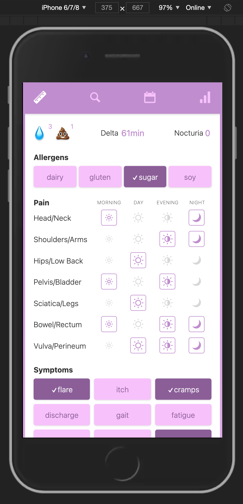
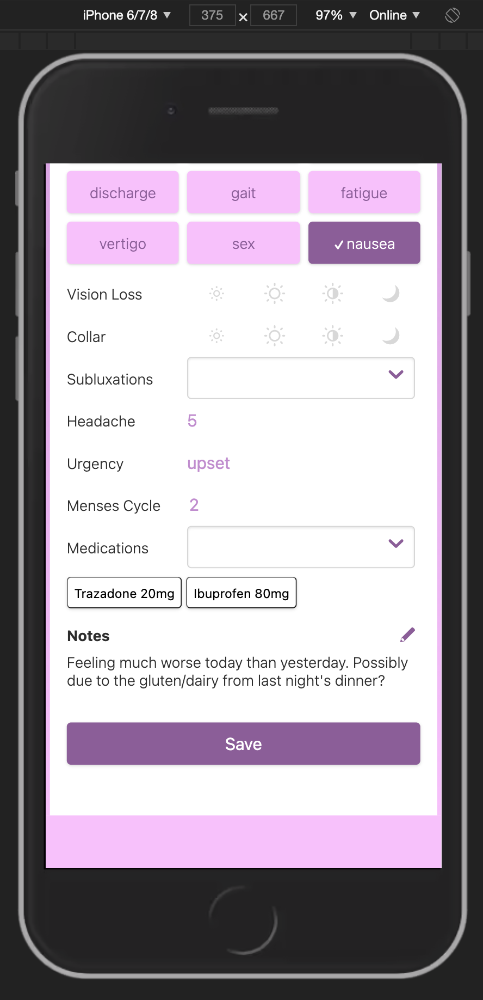
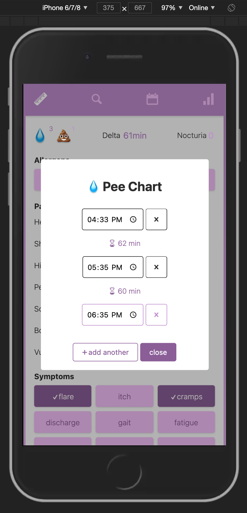
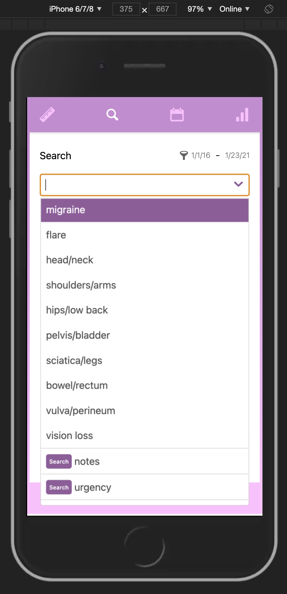
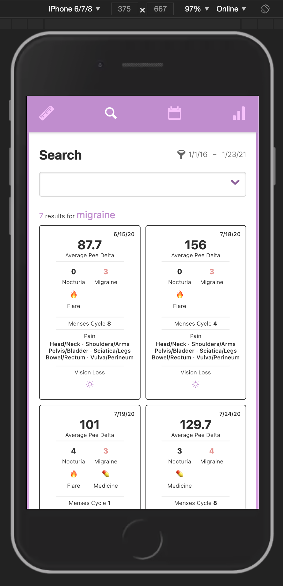

# Symptom Tracker

**WORK IN PROGRESS/PAUSED DUE TO OTHER PRIORITIES**

A symptom tracking + health dashboard app for [The Chronic](https://www.thechronic.info)

## Tech Stack

This app uses `svelte` and `svelte-spa-router` on the front end, and will use a `flask` server and `mariaDB` on the back end

It also uses several autocomplete components from [simply-svelte-autocomplete](https://github.com/themarquisdesheric/simply-svelte-autocomplete), which was made for this project

## Installation

Clone this repository to your machine and install the dependencies by running `npm i`

## Running Locally

To start the app, run `npm run dev` then navigate to http://localhost:8080

## Testing

This app is tested with [Jest](https://jestjs.io/) 

To run unit tests, run `npm test`

## UI

 

